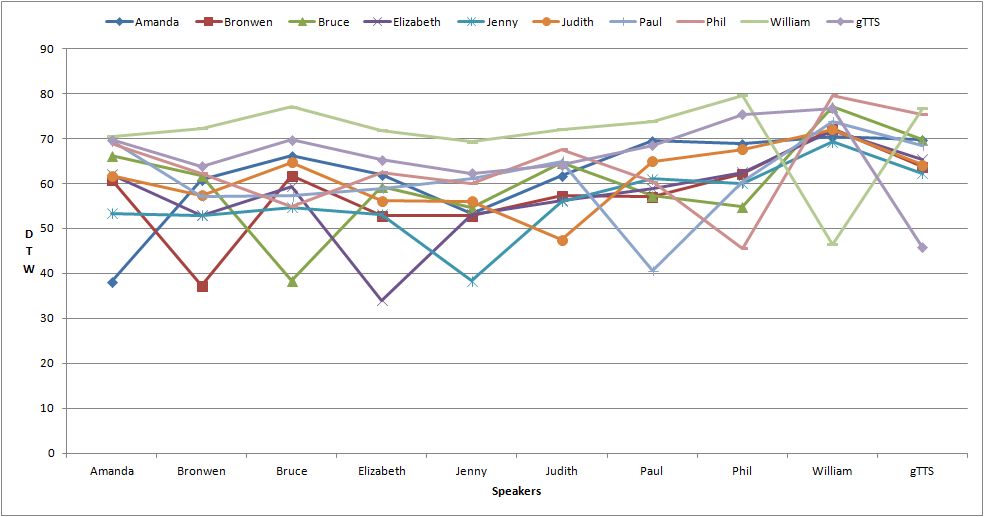
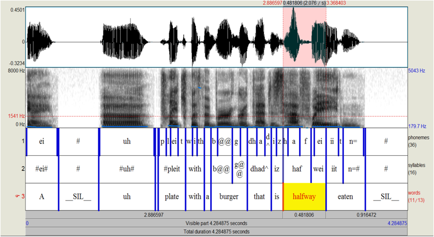

==========
SpeechCoco
==========

Introduction
============

Our corpus is an extension of the MSCOCO image recognition and captioning dataset. MSCOCO comprises images paired with a set of five captions. Yet, it does not include any speech. Therefore, we used `Voxygen's text-to-speech system <https://www.voxygen.fr/>`_ to synthesised the available captions. 

The addition of speech as a new modality enables MSCOCO to be used for researches in the field of language acquisition, unsupervised term discovery, keyword spotting, or semantic embedding using speech and vision.

Our corpus is licenced under a `Creative Commons Attribution 4.0 License <https://creativecommons.org/licenses/by/4.0/legalcode>`_.

Data Set
========

- This corpus contains **616,767** spoken captions from MSCOCO's val2014 and train2014 subsets (respectively 414,113 for train2014 and 202,654 for val2014).
- We used 8 different voices. 4 of them have a British accent (Paul, Bronwen, Judith and Elizabeth) and the 4 others have an American accent (Phil, Bruce, Amanda, Jenny).
- In order to make the captions sound more natural, we used SOX *tempo* command, enabling us to change the speed without changing the pitch. 1/3 of the captions are 10% slower than the original pace, 1/3 are 10% faster. The last third of the captions was kept untouched.
- We also modified approximately 30% of the original captions and added **disfluencies** such as "um", "uh", "er" so that the captions would sound more natural.
- Each WAV file is paired with a JSON file containing various information: timecode of each word in the caption, name of the speaker, name of the WAV file, etc. The JSON files have the following data structure:

.. code:: json

    {
        "duration": float, 
        "speaker": string, 
        "synthesisedCaption": string,
        "timecode": list, 
        "speed": float, 
        "wavFilename": string, 
        "captionID": int, 
        "imgID": int, 
        "disfluency": list
    }

- On average, each caption comprises 10.79 tokens, disfluencies included. The WAV files are on average 3.52 second long.

Inter- and intra-speaker variability
====================================

To be sure our corpus was realistic enough, we computed inter- and intra-speaker variability.
We had some sample sentences synthesised by each speaker. We then extracted words that were repeated across a few sentences. DTW was then computed for all the occurrences of the same word by the same speaker (e.g. Amanda vs Amanda) and for all the occurrences of the same word pronounced by different speakers (e.g Amanda vs Bronwen, Amanda vs Bruce, etc.).

*MFCC features were extracted using* `Librosa <https://github.com/librosa/librosa>`_ *. DTW was computed using the following* `DTW Python module <https://github.com/pierre-rouanet/dtw>`_ *. We used* euclidean *distance as cost measure.*
*The voice* William *is a real human voice*. gTTS *refers to Google's TTS system.*

========== =========== =========== =========== =========== =========== =========== =========== =========== =========== ===========
**Voices**     Amanda     Bronwen     Bruce     Elizabeth     Jenny      Judith      Paul         Phil       William      gTTS 
---------- ----------- ----------- ----------- ----------- ----------- ----------- ----------- ----------- ----------- -----------
Amanda        38,28       60,80       66,10       62,00       53,30       61,67       69,43       68,93       70,41       69,67
Bronwen       60,80       37,39       61,75       52,89       52,84       57,34       57,06       62,23       72,19       63,77
Bruce         66,10       61,75       38,35       59,34       54,68       64,65       57,23       54,83       77,02       69,71
Elizabeth     62,00       52,89       59,34       34,04       53,17       56,13       58,87       62,44       71,83       65,27
Jenny         53,30       52,84       54,68       53,17       38,30       56,00       61,02       60,05       69,21       62,28
Judith        61,67       57,34       64,65       56,13       56,00       47,49       64,94       67,59       72,08       64,16
Paul          69,43       57,06       57,23       58,87       61,02       64,94       40,54       60,37       73,73       68,41
Phil          68,93       62,23       54,83       62,44       60,05       67,59       60,37       45,57       79,60       75,38
William       70,41       72,19       77,02       71,83       69,21       72,08       73,73       79,60       46,47       76,74
gTTS          69,67       63,77       69,71       65,27       62,28       64,16       68,41       75,38       76,74       45,77
========== =========== =========== =========== =========== =========== =========== =========== =========== =========== ===========

As expected intra-speaker variability is lower than inter-speaker variability. Inter-variability is greater between William and the other voices, which is to be expected as William is a real human voice. However, **inter-variability between the synthetic voices is still high** meaning the corpus we synthesised is realistic.

References
==========

As for now, we didn't publish any article describing in details our corpus and methodology.
You might want to read the following papers if you wish to learn more about MSCOCO. 

Chen, X., Fang, H., Lin, T.-Y., Vedantam, R., Gupta, S., Dollar, P., & Zitnick, C. Lawrence. (2015). Microsoft COCO Captions: Data Collection and Evaluation Server. 

Lin, T.-Y., Maire, M., Belongie, S., Bourdev, L., Girshick, R., Hays, J., Dollár, P. (2014). Microsoft COCO: Common Objects in Context.

Contents
========

The repository is organized as follows:

- CORPUS-MSCOCO (~75GB)

    - **train2014/** : folder contains 413,915 captions
       - json/
       - wav/
       - translations/
              - train_en_ja.txt
              - train_translate.sqlite3       
       - train_2014.sqlite3
       
    - **val2014/** : folder contains 202,520 captions
       - json/
       - wav/
       - translations/
              - train_en_ja.txt
              - train_translate.sqlite3 
       - val_2014.sqlite3

    - **speechcoco_API/**
           - speechcoco/
                  - __init__.py
                  - speechcoco.py
           - setup.py

Filenames
=========

**.wav** files contain the spoken version of a caption

**.json** files contain all the metadata of a given WAV file

**.sqlite3** files are SQLite databases containing all the information contained in the JSON files

We adopted the following naming convention for both the WAV and JSON files:

*imageID_captionID_Speaker_DisfluencyPosition_Speed[.wav/.json]*

Script
======

We created a script called **speechcoco.py** in order to handle the metadata and allow the user to easily find captions according to specific filters. The script uses the \*.db files.

Features:

- **Aggregate all the information in the JSON files into a single SQLite database**
- **Find captions according to specific filters (name, gender and nationality of the speaker, disfluency position, speed, duration, and words in the caption).** *The script automatically builds the SQLite query. The user can also provide his own SQLite query.*

*The following Python code returns all the captions spoken by a male with an american accent for which the speed was slown down by 10% and that contain "keys" at any position*

.. code:: python

    # create SpeechCoco object
    db = SpeechCoco(train_2014.sqlite3, train_translate.sqlite3, verbose=True)

    # filter captions (returns Caption Objects)
    captions = db.filterCaptions(gender="Male", nationality="US", speed=0.9, text='%keys%')
    for caption in captions:
        print('\n{}\t{}\t{}\t{}\t{}\t{}\t\t{}'.format(caption.imageID,
                                                      caption.captionID,
                                                      caption.speaker.name,
                                                      caption.speaker.nationality,
                                                      caption.speed,
                                                      caption.filename,
                                                      caption.text))

.. code:: console

    ...
    298817	26763	Phil	0.9	298817_26763_Phil_None_0-9.wav		A group of turkeys with bushes in the background.
    108505	147972	Phil	0.9	108505_147972_Phil_Middle_0-9.wav		Person using a, um, slider cell phone with blue backlit keys.
    258289	154380	Bruce	0.9	258289_154380_Bruce_None_0-9.wav		Some donkeys and sheep are in their green pens .
    545312	201303	Phil	0.9	545312_201303_Phil_None_0-9.wav		A man walking next to a couple of donkeys.
    ...

- **Find all the captions belonging to a specific image**

.. code:: python

    captions = db.getImgCaptions(298817)
    for caption in captions:
        print('\n{}'.format(caption.text))

.. code:: console

    Birds wondering through grassy ground next to bushes.
    A flock of turkeys are making their way up a hill.
    Um, ah. Two wild turkeys in a field walking around.
    Four wild turkeys and some bushes trees and weeds.
    A group of turkeys with bushes in the background.

- **Parse the timecodes and have them structured**

**input**:

.. code:: python
   
   ...
   [1926.3068, "SYL", ""], 
   [1926.3068, "SEPR", " "], 
   [1926.3068, "WORD", "white"], 
   [1926.3068, "PHO", "w"], 
   [2050.7955, "PHO", "ai"], 
   [2144.6591, "PHO", "t"], 
   [2179.3182, "SYL", ""], 
   [2179.3182, "SEPR", " "]
   ...

**output**:

.. code:: python

   print(caption.timecode.parse())

.. code:: python

  ...
  {
  'begin': 1926.3068,
  'end': 2179.3182,
  'syllable': [{'begin': 1926.3068,
                'end': 2179.3182,
                'phoneme': [{'begin': 1926.3068,
                             'end': 2050.7955,
                             'value': 'w'},
                            {'begin': 2050.7955,
                             'end': 2144.6591,
                             'value': 'ai'},
                            {'begin': 2144.6591,
                             'end': 2179.3182,
                             'value': 't'}],
                'value': 'wait'}],
  'value': 'white'
  },
  ...

- **Convert the timecodes to Praat TextGrid files**

.. code:: python

    caption.timecode.toTextgrid(outputDir, level=3)

- **Get the words, syllables and phonemes between** *n* **seconds/milliseconds**

*The following Python code returns all the words between 0.2 and 0.6 seconds for which at least 50% of the word's total length is within the specified interval*

.. code:: python

    pprint(caption.getWords(0.20, 0.60, seconds=True, level=1, olapthr=50))

.. code:: console

    ...
    404537	827239	Bruce	US	0.9	404537_827239_Bruce_None_0-9.wav		Eyeglasses, a cellphone, some keys and other pocket items are all laid out on the cloth. .
    [
        {
            'begin': 0.0,
            'end': 0.7202778,
            'overlapPercentage': 55.53412863758955,
            'word': 'eyeglasses'
        }
    ]
     ...
- **Get the translations of the selected captions**

*As for now, only japanese translations are available. We also used* `Kytea <http://www.phontron.com/kytea/>`_ *to tokenize and tag the captions translated with Google Translate*

.. code:: python

    captions = db.getImgCaptions(298817)
    for caption in captions:
        print('\n{}'.format(caption.text))
        
        # Get translations and POS
        print('\tja_google: {}'.format(db.getTranslation(caption.captionID, "ja_google")))
        print('\t\tja_google_tokens: {}'.format(db.getTokens(caption.captionID, "ja_google")))
        print('\t\tja_google_pos: {}'.format(db.getPOS(caption.captionID, "ja_google")))
        print('\tja_excite: {}'.format(db.getTranslation(caption.captionID, "ja_excite")))

.. code:: console

        Birds wondering through grassy ground next to bushes.
        ja_google: 鳥は茂みの下に茂った地面を抱えています。
            ja_google_tokens: 鳥 は 茂み の 下 に 茂 っ た 地面 を 抱え て い ま す 。
            ja_google_pos: 鳥/名詞/とり は/助詞/は 茂み/名詞/しげみ の/助詞/の 下/名詞/した に/助詞/に 茂/動詞/しげ っ/語尾/っ た/助動詞/た 地面/名詞/じめん を/助詞/を 抱え/動詞/かかえ て/助詞/て い/動詞/い ま/助動詞/ま す/語尾/す 。/補助記号/。
        ja_excite: 低木と隣接した草深いグラウンドを通って疑う鳥。

    A flock of turkeys are making their way up a hill.
        ja_google: 七面鳥の群れが丘を上っています。
            ja_google_tokens: 七 面 鳥 の 群れ が 丘 を 上 っ て い ま す 。
            ja_google_pos: 七/名詞/なな 面/名詞/めん 鳥/名詞/とり の/助詞/の 群れ/名詞/むれ が/助詞/が 丘/名詞/おか を/助詞/を 上/動詞/のぼ っ/語尾/っ て/助詞/て い/動詞/い ま/助動詞/ま す/語尾/す 。/補助記号/。
        ja_excite: 七面鳥の群れは丘の上で進んでいる。

    Um, ah. Two wild turkeys in a field walking around.
        ja_google: 野生のシチメンチョウ、野生の七面鳥
            ja_google_tokens: 野生 の シチメンチョウ 、 野生 の 七 面 鳥
            ja_google_pos: 野生/名詞/やせい の/助詞/の シチメンチョウ/名詞/しちめんちょう 、/補助記号/、 野生/名詞/やせい の/助詞/の 七/名詞/なな 面/名詞/めん 鳥/名詞/ちょう
        ja_excite: まわりで移動しているフィールドの2羽の野生の七面鳥

    Four wild turkeys and some bushes trees and weeds.
        ja_google: 4本の野生のシチメンチョウといくつかの茂みの木と雑草
            ja_google_tokens: 4 本 の 野生 の シチメンチョウ と いく つ か の 茂み の 木 と 雑草
            ja_google_pos: 4/名詞/４ 本/接尾辞/ほん の/助詞/の 野生/名詞/やせい の/助詞/の シチメンチョウ/名詞/しちめんちょう と/助詞/と いく/名詞/いく つ/接尾辞/つ か/助詞/か の/助詞/の 茂み/名詞/しげみ の/助詞/の 木/名詞/き と/助詞/と 雑草/名詞/ざっそう
        ja_excite: 4羽の野生の七面鳥およびいくつかの低木木と雑草

    A group of turkeys with bushes in the background.
        ja_google: 背景に茂みを持つ七面鳥の群
            ja_google_tokens: 背景 に 茂み を 持 つ 七 面 鳥 の 群
            ja_google_pos: 背景/名詞/はいけい に/助詞/に 茂み/名詞/しげみ を/助詞/を 持/動詞/も つ/語尾/つ 七/名詞/なな 面/名詞/めん 鳥/名詞/ちょう の/助詞/の 群/名詞/むれ
        ja_excite: 背景の低木を持つ七面鳥のグループ
